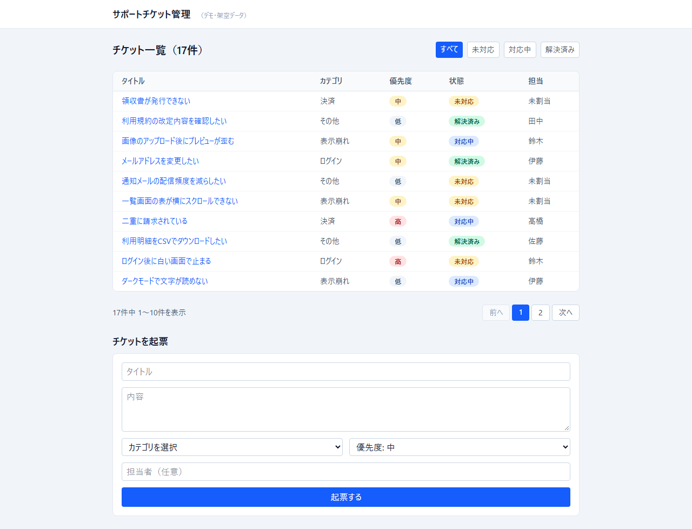
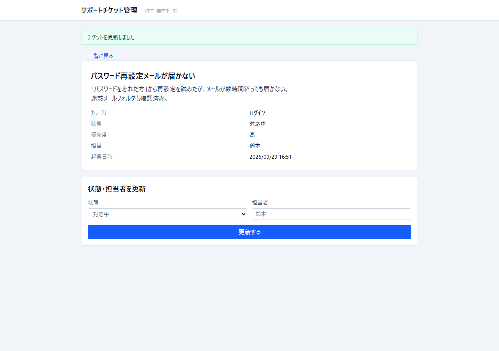
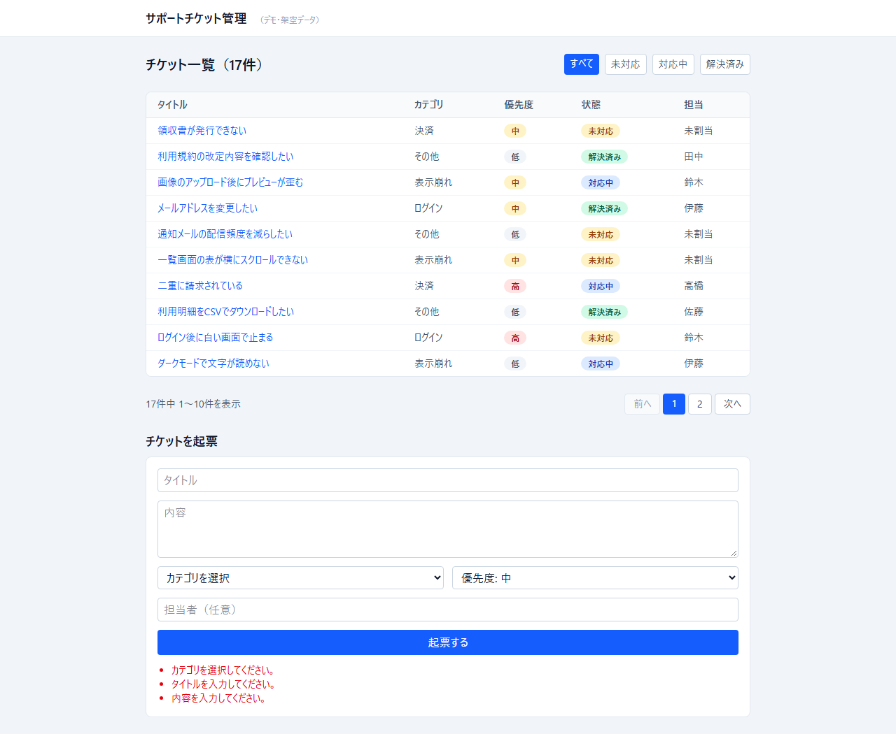
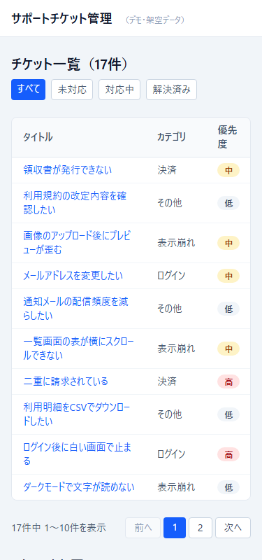

# サポートチケット管理システム（デモ・架空データ）

小規模なサポートチケット管理システムの制作例。Laravel（PHP）+ Eloquent ORM + Blade + Tailwind CSS で構築。
業務で受託した案件ではなく、**すべて架空データ**（シーダーで生成）で作成した自主制作のデモです。

## スクリーンショット
（架空データ。左から順に、一覧／詳細／バリデーション／モバイル）









## 機能
- チケット一覧（タイトル・カテゴリ・優先度・状態・担当者）
- 状態フィルタ（すべて／未対応／対応中／解決済み）
- チケットの起票（フォーム→バリデーション→一覧に即反映）
- チケットの詳細ページ
- 状態（未対応／対応中／解決済み）と担当者の更新（`PATCH /tickets/{ticket}`・`PATCH /api/tickets/{ticket}`、更新後は「チケットを更新しました」を表示）
- 一覧のページ送り（10件ずつ・状態フィルタを維持）。APIの一覧もページネーション付きで、`data`に加え`links`/`meta`を返す
- 同じデータをJSON APIとしても提供（`/api/tickets`）
- 入力バリデーション（Form Requestクラス・カテゴリ存在チェック・優先度／状態の値チェック・日本語メッセージ）

## 技術構成
- **Laravel 13**: MVC構成（ルート→コントローラ→Eloquentモデル→Bladeビュー）、Web用とAPI用でルート・コントローラを分離（`routes/web.php`と`routes/api.php`）
- **Eloquent ORM**: `Category` hasMany `Ticket`（外部キー制約付きマイグレーション）、クエリスコープ（`Ticket::status()`）
- **バリデーション**: `StoreTicketRequest`／`UpdateTicketRequest`（Form Request）でカテゴリ存在チェック・優先度と状態の許容値・必須項目を検証
- **API**: `TicketResource`でJSONの整形（`whenLoaded`でN+1を避けたカテゴリ埋め込み）
- **Tailwind CSS 4**（Vite経由・Laravel標準構成）

## 動作確認方法
コードレビューだけでなく、実際にマイグレーション・起動・自動テストで検証している。

```bash
composer install
cp .env.example .env          # Windows（cmd）は copy .env.example .env
php artisan key:generate
php artisan migrate           # SQLiteファイルが無ければ作成を確認されるので yes
npm install && npm run build
php artisan test              # 32件の自動テスト（Feature: Web/API/モデル）
php artisan db:seed --class=TicketSeeder   # 架空データ17件を投入
php artisan serve --port=8123 &
node smoke-test.mjs           # 起動中のサーバーに対する9項目の追加検証
```

PHP 8.3以上・Composer・Node.jsが必要です。

`php artisan test`（32件・93アサーション）が確認する内容:
- Web: 一覧表示・状態フィルタ・起票→詳細ページへのリダイレクト・バリデーションエラー（タイトル必須／カテゴリ存在チェック）・404
- API: JSON形式の一覧・状態フィルタ・起票時201・バリデーションエラー時422（優先度不正／本文必須）
- 更新・ページ送り: 状態／担当者のWeb・API更新、不正な状態（Webは日本語エラー・APIは422）、存在しないチケットの404、ページ送りでの状態フィルタ維持
- モデル: リレーション（`belongsTo`/`hasMany`）・スコープ・ビジネスロジック（`isOpen()`）

`smoke-test.mjs`は実際に起動したサーバーに対してAPI経由でチケットを作成し、一覧・詳細ページに反映されることを確認する（開発中に発見した実バグの回帰テストを含む: `Ticket::create()`が返す直後のモデルはDBのデフォルト値`status`列を自動反映しないため、`app/Models/Ticket.php`に明示的な既定値を追加して修正）。

ブラウザでの表示は375px（モバイル）・768px（タブレット）・1280px（デスクトップ）の3幅で目視確認済み。

## 対象範囲外
- 認証・認可（ログイン・権限管理）は、このデモの対象外です（誰でもチケットを閲覧・起票できる構成）。

## ディレクトリ構成
```
app/
  Models/Category.php  Models/Ticket.php
  Http/Controllers/TicketController.php       Web用
  Http/Controllers/Api/TicketApiController.php API用
  Http/Requests/StoreTicketRequest.php, UpdateTicketRequest.php  バリデーション
  Http/Resources/TicketResource.php            APIレスポンス整形
database/
  migrations/  カテゴリ・チケットのテーブル定義
  factories/   テスト用ファクトリ
  seeders/TicketSeeder.php  架空データ17件
resources/views/
  layouts/app.blade.php  tickets/index.blade.php  tickets/show.blade.php
  pagination/japanese.blade.php  日本語のページ送り
docs/screenshots/  READMEのスクリーンショット
routes/
  web.php  api.php
tests/Feature/
  TicketWebTest.php  TicketApiTest.php  TicketModelTest.php  TicketUpdateTest.php
smoke-test.mjs  起動中のサーバーに対する自動検証スクリプト
```
